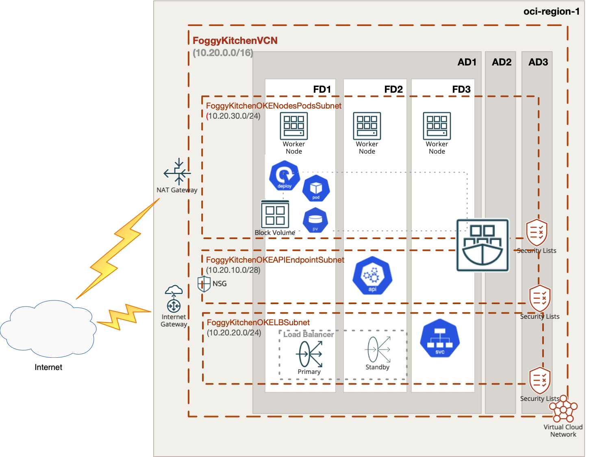

# OCI Container Engine for Kubernetes (aka OCI OKE) with OCI Block Volume as PVC

## Project description

In this repository, I have documented my hands on experience with Terrafrom for the purpose of Container Engine for Kubernetes (aka OCI OKE) deployment with OCI Block Volume as PVC. This set of HCL based Terraform files which can customized according to any requirements.  

## Topology Diagram 

With the usage of this example HCL code you can build topology documented by diagram below. This topology is extremly simplified for education purposes and rather cannot be used for production implementations. 



## How to use code 

### Deploy Using Oracle Resource Manager

1. Click [](https://cloud.oracle.com/resourcemanager/stacks/create?region=home&zipUrl=https://github.com/mlinxfeld/terraform-oci-oke-pvc/releases/latest/download/terraform-oci-oke-pvc-stack-latest.zip)

    If you aren't already signed in, when prompted, enter the tenancy and user credentials.

2. Review and accept the terms and conditions.

3. Select the region where you want to deploy the stack.

4. Follow the on-screen prompts and instructions to create the stack.

5. After creating the stack, click **Terraform Actions**, and select **Plan**.

6. Wait for the job to be completed, and review the plan.

    To make any changes, return to the Stack Details page, click **Edit Stack**, and make the required changes. Then, run the **Plan** action again.

7. If no further changes are necessary, return to the Stack Details page, click **Terraform Actions**, and select **Apply**. 

### Deploy Using the Terraform CLI

#### STEP 1.

Clone the repo from GitHub.com by executing the command as follows and then go to terraform-oci-private-oke directory:

```
[opc@terraform-server ~]$ git clone https://github.com/mlinxfeld/terraform-oci-oke-pvc.git
Cloning into 'terraform-oci-oke-pvc'...
remote: Enumerating objects: 10, done.
remote: Counting objects: 100% (10/10), done.
remote: Compressing objects: 100% (10/10), done.
remote: Total 10 (delta 0), reused 10 (delta 0), pack-reused 0
Unpacking objects: 100% (10/10), done.

[opc@terraform-server ~]$ cd terraform-oci-oke-pvc/

[opc@terraform-server terraform-oci-oke-pvc]$ ls -latr

-rw-r--r--@  1 opc opc  13187 Jun 11 10:54 README.md
-rw-r--r--   1 opc opc    197 Jun 11 10:54 compartment.tf
-rw-r--r--   1 opc opc  10345 Jun 11 10:54 schema.yaml
-rw-r--r--@  1 opc opc 690081 Jun 11 10:54 terraform-oci-oke-pvc.jpg
-rw-r--r--   1 opc opc     80 Jun 11 10:54 tls.tf
drwxr-xr-x   3 opc opc     96 Jun 11 11:21 templates
-rw-r--r--   1 opc opc    743 Jun 11 11:23 provider.tf
-rw-r--r--   1 opc opc    892 Jun 11 12:35 outputs.tf
-rw-r--r--   1 opc opc    614 Jun 11 12:45 .gitignore
-rw-r--r--   1 opc opc   1359 Jun 12 09:52 locals.tf
-rw-r--r--   1 opc opc   1601 Jun 12 09:53 datasources.tf
-rw-r--r--   1 opc opc  13438 Jun 12 11:17 network.tf
-rw-r--r--   1 opc opc   2655 Jun 12 11:33 oke.tf
-rw-r--r--   1 opc opc   2955 Jun 12 11:48 oke_policy.tf
-rw-r--r--   1 opc opc   1521 Jun 12 12:57 oke_autoscaler.tf
-rw-r--r--   1 opc opc   2269 Jun 12 13:28 variables.tf
```

#### STEP 2.

Within web browser go to URL: https://www.terraform.io/downloads.html. Find your platform and download the latest version of your terraform runtime. Add directory of terraform binary into PATH and check terraform version:

```
[opc@terraform-server terraform-oci-oke-pvc]$ export PATH=$PATH:/home/opc/terraform

[opc@terraform-server terraform-oci-oke-pvc]$ terraform --version

Terraform v1.0.0

Your version of Terraform is out of date! The latest version
is 1.2.2. You can update by downloading from https://www.terraform.io/downloads.html
```

#### STEP 3. 
Next create environment file with TF_VARs:

```
[opc@terraform-server terraform-oci-oke-pvc]$ vi setup_oci_tf_vars.sh
export TF_VAR_user_ocid="ocid1.user.oc1..aaaaaaaaob4qbf2(...)uunizjie4his4vgh3jx5jxa"
export TF_VAR_tenancy_ocid="ocid1.tenancy.oc1..aaaaaaaas(...)krj2s3gdbz7d2heqzzxn7pe64ksbia"
export TF_VAR_compartment_ocid="ocid1.tenancy.oc1..aaaaaaaasbktyckn(...)ldkrj2s3gdbz7d2heqzzxn7pe64ksbia"
export TF_VAR_fingerprint="00:f9:d1:41:bb:57(...)82:47:e6:00"
export TF_VAR_private_key_path="/tmp/oci_api_key.pem"
export TF_VAR_region="eu-frankfurt-1"
export TF_VAR_private_key_oci="/tmp/id_rsa"
export TF_VAR_public_key_oci="/tmp/id_rsa.pub"

[opc@terraform-server terraform-oci-oke-pvc]$ source setup_oci_tf_vars.sh
```

#### STEP 4.
Run *terraform init* with upgrade option just to download the lastest neccesary providers:

```
[opc@terraform-server terraform-oci-oke-pvc]$ terraform init 

Initializing the backend...

Initializing provider plugins...
- Finding latest version of hashicorp/null...
- Finding latest version of hashicorp/template...
- Finding latest version of oracle/oci...
- Finding latest version of hashicorp/random...
- Finding latest version of hashicorp/tls...
- Finding latest version of hashicorp/local...
- Installing hashicorp/template v2.2.0...
- Installed hashicorp/template v2.2.0 (signed by HashiCorp)
- Installing oracle/oci v4.84.0...
- Installed oracle/oci v4.84.0 (signed by a HashiCorp partner, key ID 1533A49284137CEB)
- Installing hashicorp/random v3.3.1...
- Installed hashicorp/random v3.3.1 (signed by HashiCorp)
- Installing hashicorp/tls v3.4.0...
- Installed hashicorp/tls v3.4.0 (signed by HashiCorp)
- Installing hashicorp/local v2.2.3...
- Installed hashicorp/local v2.2.3 (signed by HashiCorp)
- Installing hashicorp/null v3.1.1...
- Installed hashicorp/null v3.1.1 (signed by HashiCorp)

Partner and community providers are signed by their developers.
If you'd like to know more about provider signing, you can read about it here:
https://www.terraform.io/docs/cli/plugins/signing.html

Terraform has created a lock file .terraform.lock.hcl to record the provider
selections it made above. Include this file in your version control repository
so that Terraform can guarantee to make the same selections by default when
you run "terraform init" in the future.

Terraform has been successfully initialized!

You may now begin working with Terraform. Try running "terraform plan" to see
any changes that are required for your infrastructure. All Terraform commands
should now work.

If you ever set or change modules or backend configuration for Terraform,
rerun this command to reinitialize your working directory. If you forget, other
commands will detect it and remind you to do so if necessary.
```

#### STEP 5.
Run *terraform apply* to provision the content of this repo (type **yes** to confirm the the apply phase):

```
[opc@terraform-server terraform-oci-oke-pvc]$ terraform apply

data.oci_identity_availability_domains.ADs: Reading...
data.oci_core_services.FoggyKitchenAllOCIServices: Reading...
data.oci_core_images.InstanceImageOCID: Reading...
data.oci_containerengine_node_pool_option.FoggyKitchenOKEClusterNodePoolOption: Reading...
data.oci_containerengine_cluster_option.FoggyKitchenOKEClusterOption: Reading...
data.oci_identity_region_subscriptions.home_region_subscriptions: Reading...
data.oci_identity_availability_domains.ADs: Read complete after 1s [id=IdentityAvailabilityDomainsDataSource-3269541301]
data.oci_core_images.InstanceImageOCID: Read complete after 2s [id=CoreImagesDataSource-646959641]
data.oci_identity_region_subscriptions.home_region_subscriptions: Read complete after 1s [id=IdentityRegionSubscriptionsDataSource-3269541301]
data.oci_containerengine_cluster_option.FoggyKitchenOKEClusterOption: Read complete after 1s [id=ContainerengineClusterOptionDataSource-1870923232]
data.oci_core_services.FoggyKitchenAllOCIServices: Read complete after 2s [id=CoreServicesDataSource-0]
data.oci_containerengine_node_pool_option.FoggyKitchenOKEClusterNodePoolOption: Read complete after 2s [id=ContainerengineNodePoolOptionDataSource-1870923232]

Terraform used the selected providers to generate the following execution plan. Resource actions are indicated with the following symbols:
  + create
 <= read (data resources)

Terraform will perform the following actions:

  # data.template_file.pvc_deployment will be read during apply
  # (config refers to values not yet known)
 <= data "template_file" "pvc_deployment" {
      + id       = (known after apply)
      + rendered = (known after apply)

(...)

Plan: 22 to add, 0 to change, 0 to destroy.

Changes to Outputs:
  + cluster_instruction = (known after apply)

Do you want to perform these actions?
  Terraform will perform the actions described above.
  Only 'yes' will be accepted to approve.

  Enter a value:

(...)

null_resource.deploy_oke_pvc: Still creating... [1m50s elapsed]
null_resource.deploy_oke_pvc: Still creating... [2m0s elapsed]
null_resource.deploy_oke_pvc: Still creating... [2m10s elapsed]
null_resource.deploy_oke_pvc: Provisioning with 'local-exec'...
null_resource.deploy_oke_pvc (local-exec): Executing: ["/bin/sh" "-c" "kubectl get pvc"]
null_resource.deploy_oke_pvc (local-exec): NAME            STATUS   VOLUME                                                                                         CAPACITY   ACCESS MODES   STORAGECLASS   AGE
null_resource.deploy_oke_pvc (local-exec): fkblockvolume   Bound    ocid1.volume.oc1.eu-amsterdam-1.abqw2ljrvggl3hduqla5mqgkuuqkx3guvo2e2it66ddocfvnv5u4k43ui2aq   50Gi       RWO            oci            2m2s
null_resource.deploy_oke_pvc: Creation complete after 2m13s [id=6568020739120620322]
null_resource.deploy_oke_nginx: Creating...
null_resource.deploy_oke_nginx: Provisioning with 'local-exec'...
null_resource.deploy_oke_nginx (local-exec): Executing: ["/bin/sh" "-c" "kubectl apply -f ./nginx.yaml"]
null_resource.deploy_oke_nginx (local-exec): pod/nginx created
null_resource.deploy_oke_nginx: Provisioning with 'local-exec'...
null_resource.deploy_oke_nginx (local-exec): Executing: ["/bin/sh" "-c" "sleep 120"]
null_resource.deploy_oke_nginx: Still creating... [10s elapsed]
null_resource.deploy_oke_nginx: Still creating... [20s elapsed]
null_resource.deploy_oke_nginx: Still creating... [30s elapsed]
null_resource.deploy_oke_nginx: Still creating... [40s elapsed]
null_resource.deploy_oke_nginx: Still creating... [50s elapsed]
null_resource.deploy_oke_nginx: Still creating... [1m0s elapsed]
null_resource.deploy_oke_nginx: Still creating... [1m10s elapsed]
null_resource.deploy_oke_nginx: Still creating... [1m20s elapsed]
null_resource.deploy_oke_nginx: Still creating... [1m30s elapsed]
null_resource.deploy_oke_nginx: Still creating... [1m40s elapsed]
null_resource.deploy_oke_nginx: Still creating... [1m50s elapsed]
null_resource.deploy_oke_nginx: Still creating... [2m0s elapsed]
null_resource.deploy_oke_nginx: Provisioning with 'local-exec'...
null_resource.deploy_oke_nginx (local-exec): Executing: ["/bin/sh" "-c" "kubectl describe pod nginx"]
null_resource.deploy_oke_nginx: Still creating... [2m10s elapsed]
null_resource.deploy_oke_nginx (local-exec): Name:         nginx
null_resource.deploy_oke_nginx (local-exec): Namespace:    default
null_resource.deploy_oke_nginx (local-exec): Priority:     0
null_resource.deploy_oke_nginx (local-exec): Node:         10.20.10.16/10.20.10.16
null_resource.deploy_oke_nginx (local-exec): Start Time:   Tue, 19 Jul 2022 19:35:40 +0200
null_resource.deploy_oke_nginx (local-exec): Labels:       <none>
null_resource.deploy_oke_nginx (local-exec): Annotations:  <none>
null_resource.deploy_oke_nginx (local-exec): Status:       Running
null_resource.deploy_oke_nginx (local-exec): IP:           10.244.1.3
null_resource.deploy_oke_nginx (local-exec): IPs:
null_resource.deploy_oke_nginx (local-exec):   IP:  10.244.1.3
null_resource.deploy_oke_nginx (local-exec): Containers:
null_resource.deploy_oke_nginx (local-exec):   nginx:
null_resource.deploy_oke_nginx (local-exec):     Container ID:   cri-o://8dbf3858f5f747fe5e0f1e1333e6dfe57e1f194582067c9e6f18912697f5cf39
null_resource.deploy_oke_nginx (local-exec):     Image:          nginx:latest
null_resource.deploy_oke_nginx (local-exec):     Image ID:       docker.io/library/nginx@sha256:33cef86aae4e8487ff23a6ca16012fac28ff9e7a5e9759d291a7da06e36ac958
null_resource.deploy_oke_nginx (local-exec):     Port:           80/TCP
null_resource.deploy_oke_nginx (local-exec):     Host Port:      0/TCP
null_resource.deploy_oke_nginx (local-exec):     State:          Running
null_resource.deploy_oke_nginx (local-exec):       Started:      Tue, 19 Jul 2022 19:36:30 +0200
null_resource.deploy_oke_nginx (local-exec):     Ready:          True
null_resource.deploy_oke_nginx (local-exec):     Restart Count:  0
null_resource.deploy_oke_nginx (local-exec):     Environment:    <none>
null_resource.deploy_oke_nginx (local-exec):     Mounts:
null_resource.deploy_oke_nginx (local-exec):       /usr/share/nginx/html from data (rw)
null_resource.deploy_oke_nginx (local-exec):       /var/run/secrets/kubernetes.io/serviceaccount from kube-api-access-gwjxw (ro)
null_resource.deploy_oke_nginx (local-exec): Conditions:
null_resource.deploy_oke_nginx (local-exec):   Type              Status
null_resource.deploy_oke_nginx (local-exec):   Initialized       True
null_resource.deploy_oke_nginx (local-exec):   Ready             True
null_resource.deploy_oke_nginx (local-exec):   ContainersReady   True
null_resource.deploy_oke_nginx (local-exec):   PodScheduled      True
null_resource.deploy_oke_nginx (local-exec): Volumes:
null_resource.deploy_oke_nginx (local-exec):   data:
null_resource.deploy_oke_nginx (local-exec):     Type:       PersistentVolumeClaim (a reference to a PersistentVolumeClaim in the same namespace)
null_resource.deploy_oke_nginx (local-exec):     ClaimName:  fkblockvolume
null_resource.deploy_oke_nginx (local-exec):     ReadOnly:   false
null_resource.deploy_oke_nginx (local-exec):   kube-api-access-gwjxw:
null_resource.deploy_oke_nginx (local-exec):     Type:                    Projected (a volume that contains injected data from multiple sources)
null_resource.deploy_oke_nginx (local-exec):     TokenExpirationSeconds:  3607
null_resource.deploy_oke_nginx (local-exec):     ConfigMapName:           kube-root-ca.crt
null_resource.deploy_oke_nginx (local-exec):     ConfigMapOptional:       <nil>
null_resource.deploy_oke_nginx (local-exec):     DownwardAPI:             true
null_resource.deploy_oke_nginx (local-exec): QoS Class:                   BestEffort
null_resource.deploy_oke_nginx (local-exec): Node-Selectors:              <none>
null_resource.deploy_oke_nginx (local-exec): Tolerations:                 node.kubernetes.io/not-ready:NoExecute op=Exists for 300s
null_resource.deploy_oke_nginx (local-exec):                              node.kubernetes.io/unreachable:NoExecute op=Exists for 300s
null_resource.deploy_oke_nginx (local-exec): Events:
null_resource.deploy_oke_nginx (local-exec):   Type    Reason                  Age   From                     Message
null_resource.deploy_oke_nginx (local-exec):   ----    ------                  ----  ----                     -------
null_resource.deploy_oke_nginx (local-exec):   Normal  Scheduled               2m1s  default-scheduler        Successfully assigned default/nginx to 10.20.10.16
null_resource.deploy_oke_nginx (local-exec):   Normal  SuccessfulAttachVolume  105s  attachdetach-controller  AttachVolume.Attach succeeded for volume "ocid1.volume.oc1.eu-amsterdam-1.abqw2ljrvggl3hduqla5mqgkuuqkx3guvo2e2it66ddocfvnv5u4k43ui2aq"
null_resource.deploy_oke_nginx (local-exec):   Normal  Pulling                 79s   kubelet                  Pulling image "nginx:latest"
null_resource.deploy_oke_nginx (local-exec):   Normal  Pulled                  71s   kubelet                  Successfully pulled image "nginx:latest" in 7.169034237s
null_resource.deploy_oke_nginx (local-exec):   Normal  Created                 71s   kubelet                  Created container nginx
null_resource.deploy_oke_nginx (local-exec):   Normal  Started                 71s   kubelet                  Started container nginx
null_resource.deploy_oke_nginx: Creation complete after 2m11s [id=9130382581713853609]

Apply complete! Resources: 24 added, 0 changed, 2 destroyed.

Outputs:

cluster_instruction = <<EOT
1.  Open OCI Cloud Shell.

2.  Execute below command to setup OKE cluster access:

$ oci ce cluster create-kubeconfig --region eu-amsterdam-1 --cluster-id ocid1.cluster.oc1.eu-amsterdam-1.aaaaaaaaj3audjwux3v32kdq4e7zhbmkxrfbzo7k3rn2svjbmcqziwbrsgna

3.  Obtain the PVC created by the automation

$ kubectl get pvc

4.  Obtain NGINX POD description with attached PVC

$ kubectl describe pod nginx


EOT
```

#### STEP 6.
After testing the environment you can remove the OCI OKE infra. You should just run *terraform destroy* (type **yes** for confirmation of the destroy phase):

```
[opc@terraform-server terraform-oci-oke-pvc]$ terraform destroy -auto-approve

data.oci_containerengine_node_pool_option.FoggyKitchenOKEClusterNodePoolOption: Refreshing state...
(…)
oci_core_security_list.FoggyKitchenOKELBSecurityList: Destroying... [id=ocid1.securitylist.oc1.eu-amsterdam-1.aaaaaaaawny2k4l52arnbk3u2o6pdjyj6u2nfx5q44gwn62bygc3qh3tybxa]
oci_core_security_list.FoggyKitchenOKELBSecurityList: Destruction complete after 0s
oci_core_subnet.FoggyKitchenOKEAPIEndpointSubnet: Destruction complete after 2s
oci_core_route_table.FoggyKitchenVCNPublicRouteTable: Destroying... [id=ocid1.routetable.oc1.eu-amsterdam-1.aaaaaaaaq7zvvavm57uafb6auhprhjwbuhvv6bpargp4dnvrt442c3njeblq]
oci_core_security_list.FoggyKitchenOKEAPIEndpointSecurityList: Destroying... [id=ocid1.securitylist.oc1.eu-amsterdam-1.aaaaaaaajdo7gcsbd2qxzskdpzf2eug77grajwigfqic7ef7ki33pt37fvaq]
oci_core_security_list.FoggyKitchenOKEAPIEndpointSecurityList: Destruction complete after 0s
oci_core_route_table.FoggyKitchenVCNPublicRouteTable: Destruction complete after 1s
oci_core_internet_gateway.FoggyKitchenInternetGateway: Destroying... [id=ocid1.internetgateway.oc1.eu-amsterdam-1.aaaaaaaatcke5d36oagtyha5r34khcfpmyyhkbdwoclbnqxztx62do2yxneq]
oci_core_internet_gateway.FoggyKitchenInternetGateway: Destruction complete after 0s
oci_core_network_security_group.FoggyKitchenNSG: Destruction complete after 3s
oci_core_virtual_network.FoggyKitchenVCN: Destroying... [id=ocid1.vcn.oc1.eu-amsterdam-1.amaaaaaanlc5nbyac4n4shpimhzml5zpzssk3qvdtr5msfdpygjpbc6sjq2a]
oci_core_virtual_network.FoggyKitchenVCN: Destruction complete after 1s
oci_identity_compartment.FoggyKitchenCompartment: Destroying... [id=ocid1.compartment.oc1..aaaaaaaayxvhhjidfxsq35muvshgxv62ac2mn6mi2yo2xqzsq53jgkuozfwq]
oci_identity_compartment.FoggyKitchenCompartment: Destruction complete after 0s

Destroy complete! Resources: 24 destroyed.
```
